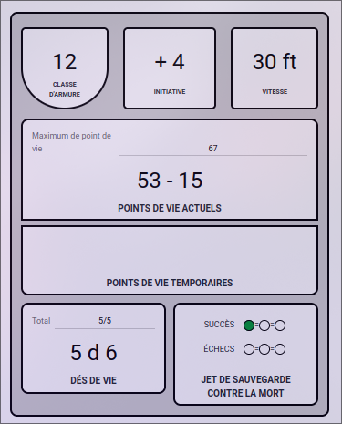
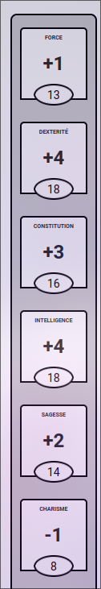
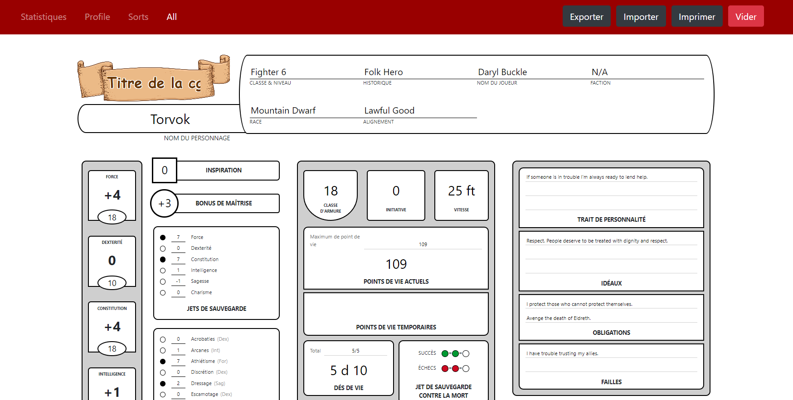

# Fiches personnage DND V5 traduite en FR

## Accéder à l'application

[Application](https://c0coleplub0.github.io/dnd-character-sheets-fr-translated/stats)

## Contenu

* [A propos 📜](#Apropos)
* [Liste des améliorations](#Listedesaméliorations)
* [Prérequis](#Prérequis)
* [Installation](#installation)
* [Utilisation](#utilisation)
* [License](#license)

## A propos 📜

Ce projet permet de créer des fiches personnages avec :

* Une page pour les statistiques 📈
* Un page pour le profile du personnage 🧙🏼‍♂️
* Une page pour les sorts 🪄

Les fiches peuvent être exportées 📥 au format Json et importées 📤.

Elles peuvent aussi être imprimées. 🖨
<!-- Visit [https://dnd5esheets.com](https://dnd5esheets.com) to see these components in use. -->

### La page Statistiques 📈 embarque les fonctionnalités suivantes

* Calcul automatique des **points de vie**
* Calcul automatique des **modificateurs**



> Appuyer sur **entré** permet d'obtenir la nouvelle valeur de HP



## Liste des améliorations par rapport au projet d'origine

* Traduction de toutes les pages en FR ✅
* Refonte de la documentation du projet
  * Comment démarrer une instance de développement localement
  * Comment utiliser le projet
* Améliorations du fonctionnement global
  * Amélioration de la visibilité des points de capacité ✅
  * Création d'une page Maître du jeu avec accès en modification à toutes les fiches
  * Création d'une page par joueur
  * Possibilité de modifier le nom de la campagne (hors code) ✅
  * Calculatrice de HP dans le champ des Points de Vie ✅



> Fiches personnage Donjon et Dragons 5ème édition crée en ReactJS.

<!-- [https://dnd5esheets.com](https://dnd5esheets.com) -->

## Pré requis

Installer nodeJs en version supérieur à v10.0.0 idéalement **v22.12.0** une version **LTS**.

[Guide d'installation de NodeJS](https://nodejs.org/fr/download/prebuilt-installer)

## Installation

Dans le répertoire principal du projet

```bash
npm install
```

## Utilisation

Dans le répertoire principal du projet. La première fois ainsi qu'à chaque édition du code source :

```bash
npm run build
```

Dans le répertoire builded_page

```bash
npm run start
```

Enfin ouvrez votre navigateur à l'adresse [http://localhost:3000](http://localhost:3000) pour apprécier le résultat 🏗

## License

MIT © [Daryl Buckle](https://github.com/DarylBuckle) 2020
